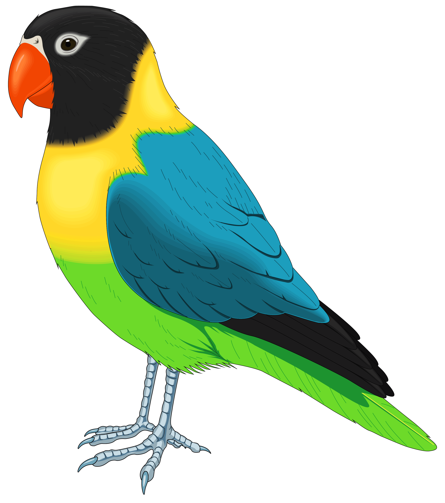
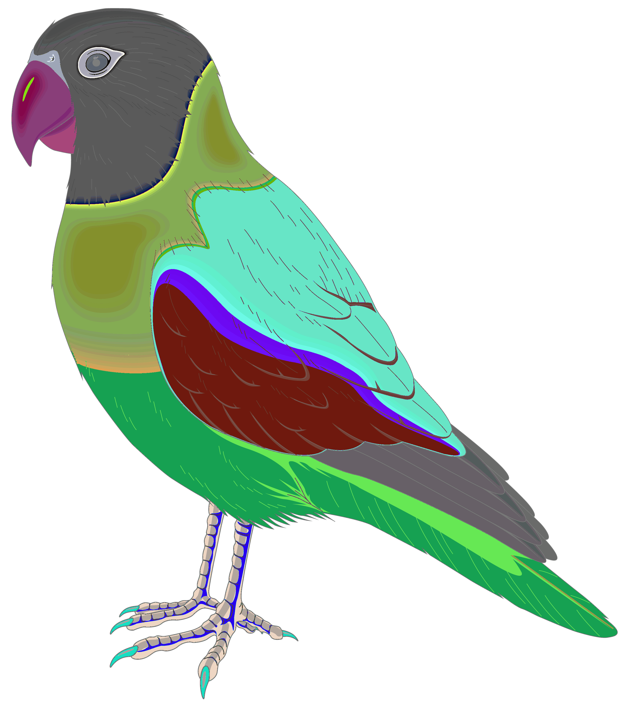
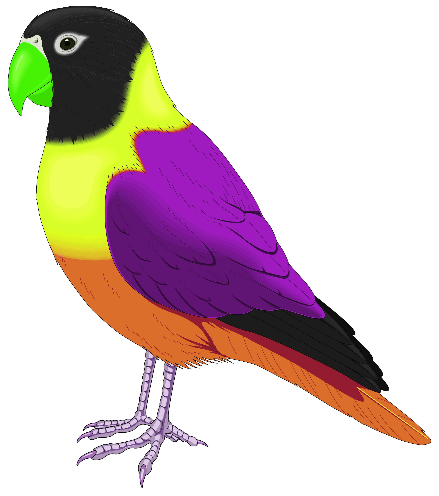

# SCT_CS_2
Task 2 - Swapped Bird Design 🐦✨   This project is part of my SCT Internship (Computer Science Track).   Created a swapped-color bird illustration using graphics editing, highlighting creativity in design &amp; digital art concepts.  
# SCT_CS_2 – Image Encryption & Decryption 🔐

## 📌 Project Overview
This task demonstrates a simple **image encryption and decryption** technique using **color channel swapping**.  
By altering the RGB channels of an image, the original picture gets "scrambled" (encrypted).  
Later, swapping the channels back restores the **original image** (decryption).

---

## 🚀 Features
- Encrypts any `.png` or `.jpg` image by channel swapping
- Decrypts the encrypted image back to original
- Built using **Python** & **OpenCV**

---

## ⚙️ Tech Stack
- Python
- OpenCV
- NumPy

---
# 🔐 Image Encryption Project

This project demonstrates **image encryption and decryption using Python**.  
The script scrambles the pixel values of an image to encrypt it and then restores the original image by decrypting it.

---

## 📂 Files in the Repository
- `image_encryption.py` → Python script for encryption & decryption  
- `ORIGINAL.png` → Original image used  
- `encrypted.png` → Encrypted image output  
- `decrypted.png` → Decrypted image output  
- `swapped.png` → Intermediate swapped image  

---

## 📸 Project Workflow







---

## 🚀 How to Run
```bash
python image_encryption.py

